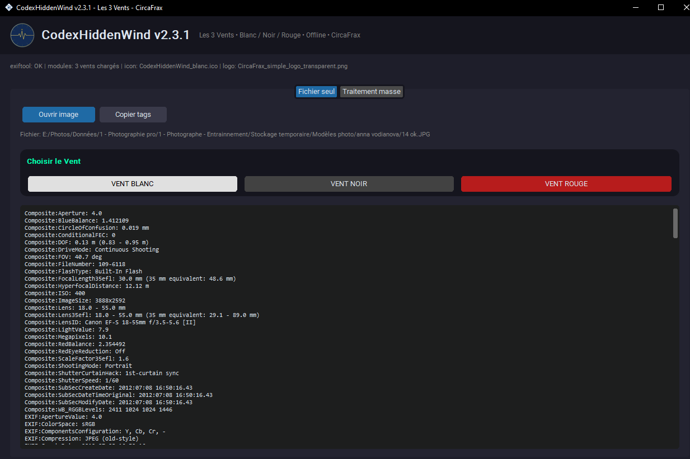

<p align="center">
  
</p>

# CodexHiddenWind v1.3

<p align="center">
  
</p>

### ⬇️ [Télécharger CodexHiddenWind v1.3 (Windows)](https://github.com/CircaFrax/CodexHiddenWind/releases/download/v1.3/CodexHiddenWind_v1.3.zip)
`SHA256: A_REMPLACER_APRES_ZIP`

> **La vie privée de vos photos en un clic. 100% portable, 100% offline.**

[]()
[]()
[]()
[]()

### Le problème
Chaque photo que vous partagez contient des métadonnées cachées : modèle d'appareil, GPS, date, logiciel... Facebook, WhatsApp ou votre employeur peuvent tout lire.

## Aperçu

*Menu à gauche, prévisualisation live à droite – 100% offline*

### La solution Codex
**CodexHiddenWind** supprime tout, localement, sans installer quoi que ce soit.

- **Glisser-déposer** : un dossier, des fichiers, tout passe
- **Voir avant de supprimer** : tableau EXIF / GPS / XMP complet
- **Nettoyage chirurgical** : `exiftool -all=` embarqué, silencieux
- **Portable** : un seul `.exe`, pas de registre, pas de cloud
- **Rapide** : barre de progression temps réel, multi-threadé


### 🚀 Installation

#### Version portable (recommandé)
1. Téléchargez `CodexHiddenWind_v1.3_Portable.zip` dans les Releases
2. Dézippez
3. Lancez `CodexHiddenWind.exe`

```
CodexHiddenWind_Portable/
├── CodexHiddenWind.exe
└── _DOC/
    ├── LEGAL_NOTICE.md
    ├── LICENCE_CircaFrax.txt
    ├── LICENCE_ExifTool.txt
    └── LICENCES_COMBINEES.txt
```

Aucune installation. Fonctionne sur clé USB.

### 📖 Utilisation
1. Cliquez sur **"Ajouter Dossier / Fichiers"** ou glissez-déposez
2. Cochez les photos à nettoyer
3. Cliquez **NETTOYER**, selectionnez le dossier de destination
4. Les originaux sont conservés, les copies apparaissent sans métadonnées dans le dossier de destination.


### 📁 Structure
```
CodexHiddenWind/
└───CodexHiddenWind.exe
    ├───exiftool.exe
    └───Guide.md
```

### 🔒 Confidentialité
- **Zéro réseau** : tout se passe sur votre PC
- `exiftool.exe` by Phil Harvey (Artistic License) - embarqué localement

### 🗺️ Roadmap
- [x] v1.3 - Nettoyage EXIF / XMP / GPS + build portable
- [ ] v1.4 - Colonne "Appareil photo" + tri + export CSV
- [ ] v1.5 - Design figé
- [ ] v2.0 - CodexArchive & CodexView (suite Codex)

### 📄 Licence
CircaFrax Proprietary Freeware

---
**Fait partie de la suite Codex** — des logiciels qui s'utilisent sans installation, comme en 1998, mais en mieux.
